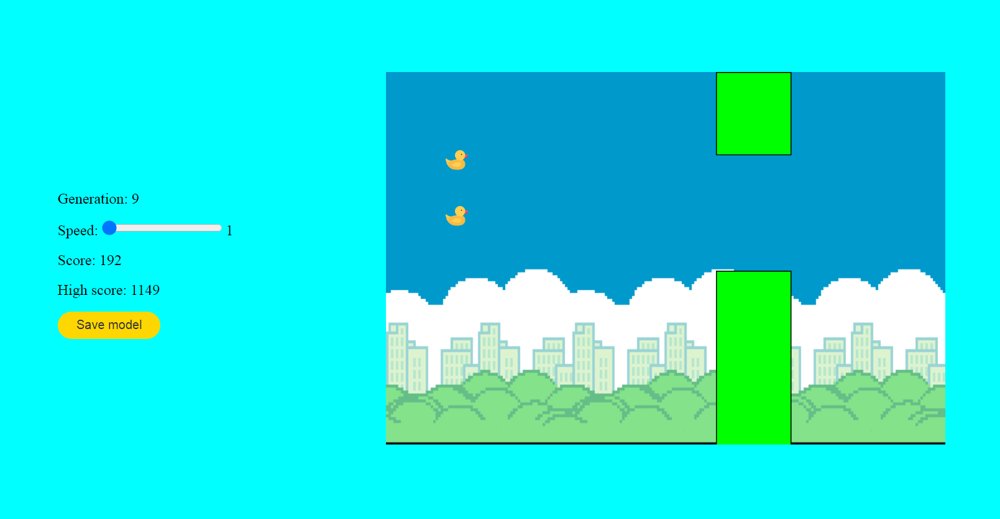
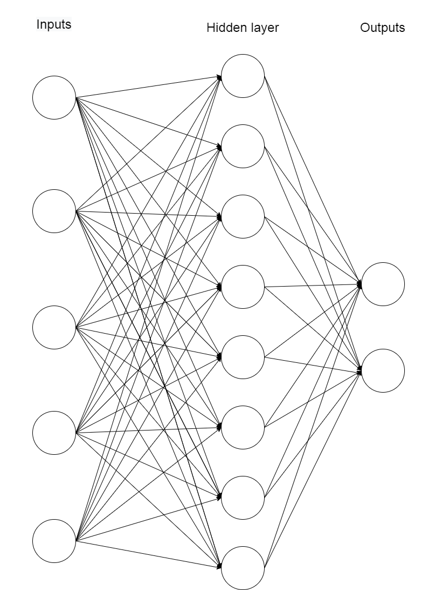

# Machine Learning Flappy Ducks using NEAT

Machine Learning Flappy Ducks implements a machine learning algorithm in the "Flappy Ducks" (based on original game called "Flappy Birds") video game using neural networks and a genetic algorithm.
Main goal of the game is to avoid pipes sticking out from above and below by the duck.

The project demonstrates the use of neuroevolution to generate agents that can make decisions to survive with the help of artificial intelligence in a generated environment with obstacles. NEAT is a genetic algorithm (GA) for the generation of evolving artificial neural networks (a neuroevolution technique).
As part of the work, an appropriately extended genetic algorithm was implemented, which was incorporated into a training system.

All the code was written in JavaScript using libraries:

- [p5.js](https://p5js.org/) - a library that facilities drawing objects in the browser, has full set of drawing functions,
- [tensorflow.js](https://www.tensorflow.org/js) - a library for creating machine learning models that can be used in the browser or node.js.

Live: https://flappy-ducks.netlify.app/

  

## Neural Network Architecture

At the beginning of the game, a generation is created in which each duck has its own neural network, which is called "the brain". The neural network consists of three layers:

- **Input layer** consists of five neurons, which include the parameters of the duck and the environment in which the duck tries to survive
- **Hidden layer** consists of eight neurons, calculations and data optimization are performed in it, for which the tensorflow library and Layers API are responsible.
- **Output layer** consists of two neurons. The output values ​​are percent probability scalar values, based on which the decision is made whether to jump or not. It looks like that both these values ​​are compared and if the first value is greater than the second, then the function responsible for jumping is called, otherwise this function is not called and the duck falls according to the defined gravity.

  

