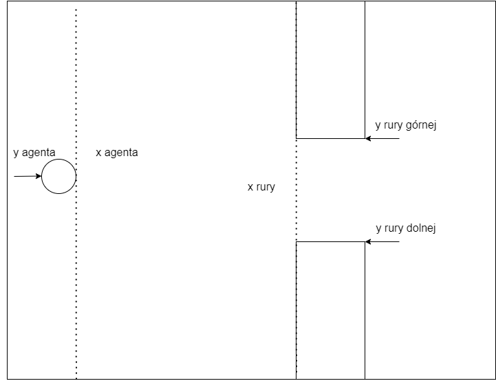

# Machine Learning Flappy Ducks using NEAT

Machine Learning Flappy Ducks was created as part of the final project for the subject machine learning in my university and implements a machine learning algorithm in the "Flappy Ducks" (based on original game called "Flappy Birds") video game using neural networks and a genetic algorithm.
Main goal of the game is to avoid pipes sticking out from above and below by the duck.

The project demonstrates the use of neuroevolution to generate agents that can make decisions to survive with the help of artificial intelligence in a generated environment with obstacles. NEAT is a genetic algorithm (GA) for the generation of evolving artificial neural networks (a neuroevolution technique).
As part of the work, an appropriately extended genetic algorithm was implemented, which was incorporated into a training system.

All the code was written in JavaScript using libraries:

- [p5.js](https://p5js.org/) - a library that facilities drawing objects in the browser, has full set of drawing functions,
- [tensorflow.js](https://www.tensorflow.org/js) - a library for creating machine learning models that can be used in the browser or node.js.

Live: https://flappy-ducks.netlify.app/

  

## Neural Network Architecture

At the beginning of the game, a generation is created in which each duck has its own neural network, which is called "the brain". The neural network consists of three layers:

- **Input layer** consists of five neurons, which include the parameters of the duck and the environment in which the duck tries to survive
- **Hidden layer** consists of eight neurons, calculations and data optimization are performed in it, for which the tensorflow library and Layers API are responsible.
- **Output layer** consists of two neurons. The output values ​​are percent probability scalar values, based on which the decision is made whether to jump or not. It looks like that both these values ​​are compared and if the first value is greater than the second, then the function responsible for jumping is called, otherwise this function is not called and the duck falls according to the defined gravity.

  

Inputs to the neural network are created on the basis of several variables:

1. Position on the x axis of the nearest obstacle
2. Upper y-axis position of the obstacle
3. Lower y-axis position of the obstacle
4. Position on the x axis of the agent
5. Agent y-axis speed

  

## Genetic Algorithm

Genetic algorithm is a metaheuristic inspired by the process of natural selection that belongs to the larger class of evolutionary algorithms. Genetic algorithms are commonly used to generate high-quality solutions to optimization and search problems by relying on biologically inspired operators such as mutation, crossover and selection.
In a genetic algorithm, a population of candidate solutions (ducks) to an optimization problem is evolved toward better solutions. Each candidate solution has a set of properties which can be mutated and altered.

The operation of the algorithm in the project is as follows:

**Step 1. Initialization:** Generation of a neural network population of 100 ducks in which each agent has random genetic material.  
**Step 2. Assessment:** Each agent in the population has its own neural network with which it makes a decision. If all the ducks in the population collide with an obstacle or with the edge of a window, they are removed and the next step is proceeded.  
**Step 3. Selection:** Calculating the fit based on the results of each element of the population meeting the specified conditions (longest surviving).  
**Step 4. Reproduction**: Selecting the parent with the relatively best match (result) and copying its neural network,
Crossbreeding - creating a child by combining half of the genetic information from one parent and the other,
Mutation - DNA mutation based on the probability percentage of a specific change.  
**Step 5. Replace the old population with the new one and return to step no. 2.**

## Resources and Credits

- D. Shiffman - [**The Nature of Code**](https://natureofcode.com/book/)
- K. O. Stanley, R. Miikkulainem - [**Evolving Neural Networks through Augmenting Topologies**](http://nn.cs.utexas.edu/downloads/papers/stanley.ec02.pdf)
